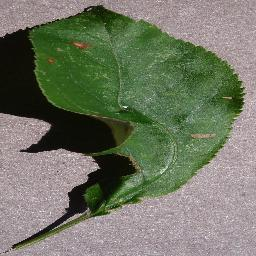

# plant-disease-prediction-cnn-deep-leanring-project
This repository is about building an Image classifier CNN with Python on Plant Disease Prediction.

Kaggle Dataset Link: https://www.kaggle.com/datasets/abdallahalidev/plantvillage-dataset


# 🌱 Plant Disease Prediction System

A Deep Learning-powered web application that classifies plant diseases from leaf images using Convolutional Neural Networks (CNNs). Built with Python, TensorFlow, and Streamlit, this system helps farmers and researchers identify plant diseases efficiently and visually.


---

## 📌 Features

- 🌿 Detects multiple plant diseases with high accuracy
- 📷 Upload leaf images via simple UI
- 🧠 Trained CNN model using TensorFlow/Keras
- 📊 Real-time prediction with confidence score
- 🌐 Built with Streamlit for quick deployment

---

## 🧠 Model Overview

- **Model Type**: Convolutional Neural Network (CNN)
- **Framework**: TensorFlow / Keras
- **Dataset**: [PlantVillage Dataset](https://www.kaggle.com/datasets/abdallahalidev/plantvillage-dataset)
- **Classes**: Tomato, Potato, Pepper, Corn, Apple, and more
- **Preprocessing**: Resizing, normalization, data augmentation
- **Accuracy Achieved**: ~95%+

---

## 🚀 Installation

### 1. Clone the Repository

```bash
git clone https://github.com/AnuragAgrahari04/Plant_Disease_Prediction_System.git
cd Plant_Disease_Prediction_System
```

### 2. Create and Activate a Virtual Environment (Optional but Recommended)

```bash
python -m venv venv
source venv/bin/activate    # On Windows: venv\Scripts\activate
```

### 3. Install Dependencies

```bash
pip install -r requirements.txt
```

> If `requirements.txt` is not available, manually install:
```bash
pip install tensorflow streamlit pillow numpy matplotlib
```

---

## 📸 Usage

### 1. Run the App

```bash
streamlit run app.py
```

### 2. Upload Leaf Image

- Open the local Streamlit page in your browser.
- Upload a leaf image using the file uploader.
- The app will show the predicted class and confidence.

---

## 🗂 Project Structure

```
Plant_Disease_Prediction_System/
│
├── app.py                  # Main Streamlit application
├── model.h5                # Trained CNN model
├── dataset/                # Training dataset (if included)
├── predict.py              # Image preprocessing & prediction
├── requirements.txt        # Python dependencies
└── README.md               # Project documentation (this file)
```

---

## 📈 Example Output

| Sample Input Image      | Prediction             |
|-------------------------|------------------------|
|  | `Tomato - Early Blight (98.6%)` |

---

## 📚 Dataset

This project uses the [PlantVillage Dataset](https://www.kaggle.com/datasets/abdallahalidev/plantvillage-dataset), a public dataset containing over 50,000 images of healthy and diseased plant leaves.

---


